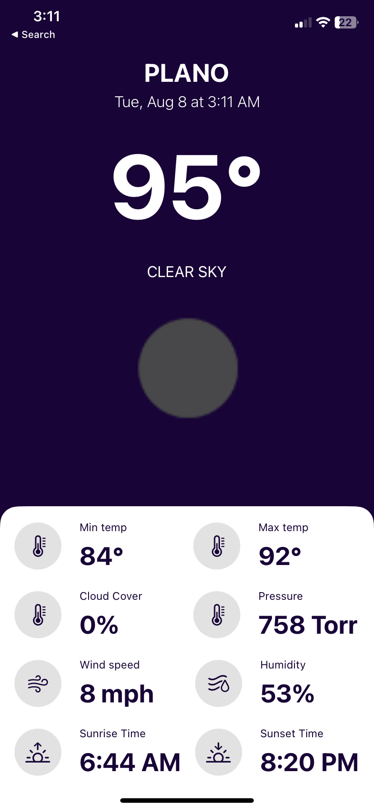

# AliWeatherApp

Currently, the App is not available in the app store.

In order to view it, you must install XCode 14+ on Mac.

After installing clone the project into a directory and plug in an iPhone running IOS 15+.

Then select the iPhone as the build target in XCode and run the project.

After a minute the app will then appear on your phone.

